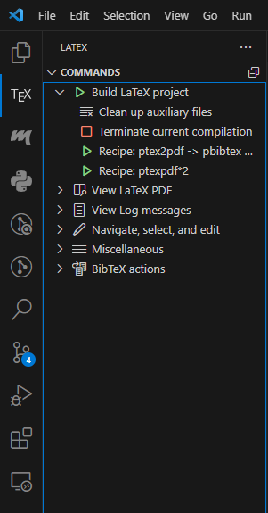

# VS Code による $\LaTeX$ 環境設定

著者：川凌司

## はじめに

著者は TeX の知識に乏しいため、誤った説明をする可能性があるのを承知の上で読んでいただきたい。

この文書では、VS Code で $\LaTeX$ 文書を最低限書けるようにするセットアップ手順を示す。
TeX 文書の書き方はここでは説明しない。

このセットアップで使用するコンパイルコマンドは`ptex2pdf`である。
これ以外のコマンドの動作は保証しないため、ほかのコマンドを使用する場合は適宜読み替えてほしい。

著者の環境は以下の通りである。

- OS: Windows 11
- VS Code: version 1.85.0
- Tex Live: version 2023
- LaTex Workshop: version 9.15.0
- ptex2pdf: version 20200520.0

## 準備するもの

VS Code で文書を書くために以下のソフトをインストールしておく。

- [Visual Studio Code](https://code.visualstudio.com/)
- [Tex Live](https://tug.org/texlive/)

なお、Tex Live については、インストールにかなり時間がかかるので、インストールを放置できる環境で行うとよい。

Tex Live が正しくインストールされたかどうかを確認するために、ターミナルで以下のコマンドを実行する。

```
> tlmgr --version
インストールに成功するとバージョン情報が出力される。
> ptex2pdf --version
インストールに成功するとバージョン情報が出力される。
```

## 環境構築手順

ここからは、VS Code と TeX Live が正しくインストールされた前提で説明する。

### LaTeX Workshop 拡張機能のインストールと設定

まず、VS Code で LaTeX 文書を簡便に書くための拡張機能をインストールする。
VS Code の拡張機能タブ（Ctrl+Shift+X）を開き、`LaTeX Workshop`と検索し、`LaTeX Workshop`拡張機能をインストールする。

インストールが完了したら VS Code の設定（Ctrl+,）を開き、右上のファイルマーク（ホバーすると「設定（JSON）を開く」とでる）から設定を JSON ファイルで開く。

開いた JSON ファイルに以下のように項目を追加する。

```JSON
{
    ...他の設定項目,

    "latex-workshop.latex.tools": [
    {
      "command": "ptex2pdf",
      "name": "ptex2pdf",
      "args": [
        "-interaction=nonstopmode",
        "-l",
        "-ot",
        "-kanji=utf8 -synctex=1",
        "%DOCFILE%.tex"
      ]
    },
    {
      "command": "pbibtex",
      "name": "pbibtex",
      "args": ["-kanji=utf8", "%DOCFILE%"]
    }
  ],
  "latex-workshop.latex.recipes": [
    {
      "name": "ptex2pdf -> pbibtex -> ptex2pdf*2",
      "tools": ["ptex2pdf", "pbibtex", "ptex2pdf", "ptex2pdf"]
    },
    {
      "name": "ptexpdf*2",
      "tools": ["ptex2pdf", "ptex2pdf"]
    }
  ],
  "latex-workshop.latex.clean.fileTypes": [
    "*.aux",
    "*.bbl",
    "*.blg",
    "*.idx",
    "*.ind",
    "*.lof",
    "*.lot",
    "*.out",
    "*.toc",
    "*.acn",
    "*.acr",
    "*.alg",
    "*.glg",
    "*.glo",
    "*.gls",
    "*.ist",
    "*.fls",
    "*.log",
    "*.fdb_latexmk",
    "*.snm",
    "*.nav",
    "*.dvi",
    "*.synctex.gz"
  ],
  "latex-workshop.latex.recipe.default": "lastUsed",

    ...他の設定項目,
}
```

ここで行っている設定の説明は以下のとおりである。

| 項目                                     | 説明                                                                                                                                                                                                                                                                                       |
| :--------------------------------------- | :----------------------------------------------------------------------------------------------------------------------------------------------------------------------------------------------------------------------------------------------------------------------------------------- |
| `"latex-workshop.latex.tools"`           | コンパイルコマンドのオプションなどを別名をつけて設定する項目。`"command"`には使用するコンパイルコマンドを、`"name"`には任意の別名、`"args"`にはコマンドのオプションを設定する。                                                                                                            |
| `"latex-workshop.latex.recipes"`         | LaTeX Workshop で実行するコマンドを指定する。TeX のコンパイルでは異なるコマンド・同一のコマンドを複数回続けて実行することが多いため、ここでその実行順（この拡張機能では「レシピ」と表記されている）を設定する。`"name"`にはレシピ名、`"tools"`には上で設定したコマンドのリストを設定する。 |
| `"latex-workshop.latex.clean.fileTypes"` | ファイルコンパイル時に生成される中間ファイル等の拡張子を設定する。ここに記載されている拡張子のファイルが LaTeX Workshop の削除コマンドで削除される。                                                                                                                                       |
| `"latex-workshop.latex.recipe.default"`  | ファイル保存時に使用するレシピの選択方法を設定する。`"lastUsed"`は最後に使用したレシピをファイル保存時に実行する。                                                                                                                                                                         |

自身でコンパイルコマンドを設定する場合は上の表を参考に追加してほしい。

### LaTeX Workshop 拡張機能の使用方法

ここでは LaTeX Workshop 拡張機能を使用して実際に TeX ファイルをコンパイルする。
使用するファイルはこのリポジトリの[/examples/latex/template.tex](./examples/latex/template.tex)である。

template.tex を開き VS Code 左側の $\TeX$ マークを押す。
開くと以下のようなタブが現れる。



このなかで`Build LaTeX project`の`Recipe: ptexpdf*2`をクリックして実行する。
すると TeX ファイルと同じ階層に pdf ファイルと中間ファイルが生成される。

この状態で上の画像の`View LaTeX PDF`もしくは TeX ファイルの右上にあるアイコン（ホバーすると「View LaTeX PDF file」とでる）をクリックすることで、コンパイルされた pdf ファイルを TeX ファイルのエディターの隣で確認できる。
これ以降はエディターで TeX ファイルを保存すると自動でコンパイルされ、コンパイルされた pdf ファイルのプレビューが自動で更新される。
pdf プレビューでは文章の部分を`Ctrl+クリック`することで、文章が書いてある位置にジャンプすることができる。

中間ファイルを削除したい場合、上の画像の`Clean up auxiliary files`をクリックすることで削除できる。

もし、コンパイルがエラー等で無限ループし止まらなくなった場合は上の画像の`Terminate current compilation`をクリックすることで、強制終了できる。

LaTeX Workshop のタブにはほかにも、`STRUCTURE`の項目があり、ここではセクションの構造を見ることができ、クリックすることでその位置にジャンプできる。
また、`SNIPPET VIEW`では LaTeX で出力できる文字・記号の一覧が表示されており、クリックすることで挿入できる。

## まとめ

VS Code による $\LaTeX$ 環境設定方法を説明した。
VS Code で LaTeX ファイルを書けると、Git による管理やスニペット機能など、VS Code の恩恵が得られるようになり、非常に高速かつ簡潔に文章を書くことができるはずである。
この文書では最低限の設定しか行わなかったが、自分でカスタマイズして自分にあった環境を構築してみてほしい。
